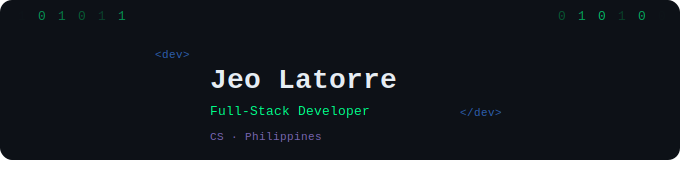

# 💫 About Me:
Computer Science graduate from Bicol University with a strong foundation in front-end web development, software engineering, and problem-solving. Has hands-on experience in full-stack development and mobile applications through OJT and organizational involvement, with growing skills in backend and mobile development. A Civil Service Professional Level passer and DOST-SEI JLSS Scholar, committed to delivering efficient, user-focused solutions through continuous learning and collaboration.

---

## 🌐 Socials

---

## 💻 Tech Stack

**Languages**

**Frontend**

**Mobile**

**Backend**

**Databases**

**AI / ML**

**Cloud & DevOps**

**Tools**

---

## 📊 GitHub Stats

