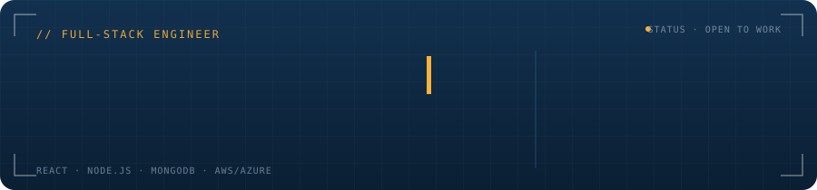

*Building production-grade systems, one real-world problem at a time.*

## 💫 About Me
Full-stack developer focused on building production-grade web and mobile applications — from backend architecture to polished UI. Continuing to ship independent projects and sharpen my craft as an engineer.

## 💻 Tech Stack

<table>
<tr>
<td valign="top" width="50%">

**Languages**

<table>
<tr>
<td align="center"> JavaScript</td>
<td align="center"> TypeScript</td>
<td align="center"> Python</td>
<td align="center"> PHP</td>
</tr>
</table>

</td>
<td valign="top" width="50%">

**Frontend & Mobile**

<table>
<tr>
<td align="center"> React</td>
<td align="center"> Next.js</td>
<td align="center"> Tailwind</td>
<td align="center"> Flutter</td>
</tr>
</table>

</td>
</tr>
<tr>
<td valign="top">

**Backend & Frameworks**

<table>
<tr>
<td align="center"> Node.js</td>
<td align="center"> Express</td>
<td align="center"> FastAPI</td>
<td align="center"> Laravel</td>
</tr>
</table>

</td>
<td valign="top">

**Cloud, Databases & DevOps**

<table>
<tr>
<td align="center"> AWS</td>
<td align="center"> Azure</td>
<td align="center"> MongoDB</td>
<td align="center"> Docker</td>
</tr>
</table>

</td>
</tr>
<tr>
<td valign="top">

**Tools**

<table>
<tr>
<td align="center"> Git</td>
<td align="center"> GitHub</td>
<td align="center"> Figma</td>
<td align="center"> Postman</td>
</tr>
</table>

</td>
<td></td>
</tr>
</table>
